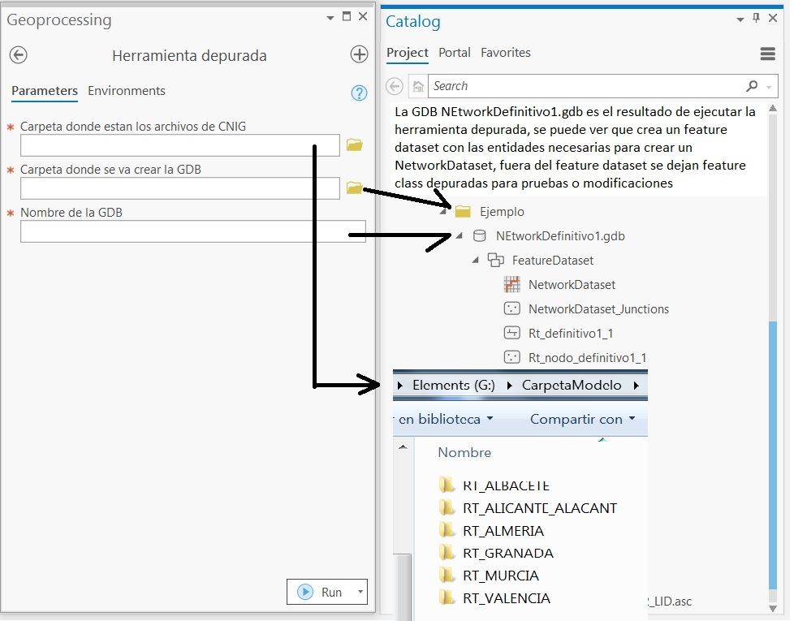

## DataAnalysisTool
**Introducción a la Herramienta**.

Herramienta con script de Python para análisis de datos CNIG. Conseguir automatizar de manera eficiente la carga y creación de archivos Network Dataset de carreteras a partir de los datos públicos del CNIG. (Redes de transporte: listado por provincias)

Desde el centro de descargas en el apartado “Información geográfica referenciada”, en la sección “Redes de transporte” se descargan los datos por provincias que queramos incluir en el ND y se guardan en una carpeta. La organización interna de cada carpeta de provincia está a su vez subdividida por el tipo de tramo, si es de ferrocarril carretera o navegable, por ello el código busca iterar entre las carpetas hasta la carpeta de Tramo Vial para de ahí obtener los archivos SHP de los tramos de carretera y sus nodos.

Para generar el Network Dataset se busca hacer un merge de los distintos tramos viales por provincia, para así tener una única FeatureClass llamada "RI_definitivo”. Cabe destacar que esta herramienta proyecta la FeatureClass a “WGS 1984 Web Mercator (auxiliary sphere)” para que sea compatible con el resto del proyecto en ArcGIS Online. Una vez creada la FeatureClass principal el código tiene el objetivo de crear campos clave para ser utilizados como atributos de viaje, como impedancias costes y restricciones. Para ello se utilizan las herramientas de AddField y CalculatedField. Para programar la herramienta de CalculatedField se ha utilizado pequeños bloques de código que definen funciones como la velocidad, el tiempo, o el consumo medio y que van en función de capos existentes en los datos del CNIG como el tipo de vía (Autopista, Urbano Carretera convencional). Estos campos en un futuro serán esenciales para crear proyectos para distintas provincias o comunidades autónomas y asegurará un mejor funcionamiento del ND. En este punto el código busca hacer este rellenado de campos de una manera replicable y automática, además, al depender de los campos del CNIG cuando estos actualicen sus datos solo será cuestión de ejecutar la herramienta con los datos nuevos para tener actualizado el Network Dataset
 
Con el Feature Class principal depurado se plantea usar el mismo código para que esta capa sea incluida en un Feature Dataset en el cual generar un Network Dataset con la clase de entidad de nodos y la clase carreteras. En este punto tenemos todo preparado para empezar a configurar las propiedades del NS y posteriormente construirlo.

**Como usar la Herramienta**.
Para la parametrización de la herramienta se ha buscado hacerla intuitiva y con el menor número posible de parámetros de entrada.
El primer parámetro y el más complejo será el de “Carpeta donde están los archivos del CNIG” este pide de entrada una carpeta que incluya los datos del CNIG. Para la carga de datos en esta carpeta se adjunta a continuación una pequeña guía con los pasos a seguir:
 
1. Descargar por provincias los datos en el centro de descargas del CNIG
 

 
2. Extraer los archivos y dejarlos alojados en la carpeta modelo. Esta será la carpeta que nos pedirá el primer parámetro de entrada de la Herramienta. 

3. A la izquierda se muestra la herramienta y a la derecha el resultado de ejecutarla. Como se puede observar el primer parámetro nos pedirá como dato de entrada la “carpeta modelo” confeccionada en el paso 2. 
El segundo parámetro nos pide una carpeta donde crear la GDB y el tercero el nombre de esta.
A la derecha se puede ver el resultado de ejecutar la herramienta y la estructura de datos que crea.

Ajustar los parámetros y atributos de viaje:

A continuación, se muestra como se ha configurado el NetworkDataset, este apartado ya no es automatizable y se realiza manualmente ya que no se ha encontrado la manera eficaz de modificar con Python las propiedades del NetworkDataset. Desde ArcGIS pro configuramos los modos de viaje (“Travel models”), los Costes (“Costs”) y las Restricciones(“Restrictions”) a partir de los campos calculados con la herramienta. Con esto ya estaría listo el Network Dataset para construir y comenzar a realizar distintos análisis de red.
1. Modo de viaje: 

1. Costes: 

